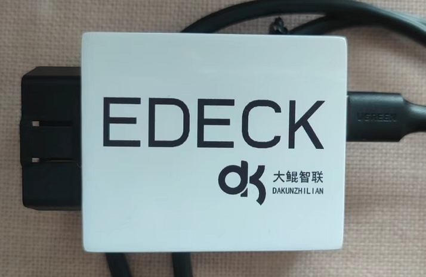

# canfuzz
canfuzz是一个模块化的结构程序，使用之前俄罗斯黑客制作的fuzz引擎(后来闭源了，链接也找不到了)。通过不同模块组合实现不同功能。每个子功能模块的实现都是一个继承自`frame/kernel/module.py`文件下`Command`类的类。通过基类[`Command`](./doc/command.md)，L6引擎来通一管理子功能模块的接口。

*edeck*的模块以开源工程[*panda*](https://github.com/commaai/panda.git)为基础进行裁剪而成。

# IO模块

* [CANSocket](./doc/modules/hw_CANSocket.md)
* [hw_edeck](./doc/modules/hw_edeck.md)
* [hw_fackIO](./doc/modules/hw_fakeIO.md)
* [TCP2CAN](./doc/modules/hw_TCP2CAN.md)

# 分析模块

* [analyze](./doc/modules/analyze.md)
* [filter](./doc/modules/filter.md)
* [fuzz](./doc/modules/fuzz.md)
* [ping](./doc/modules/ping.md)
* [pipe_switch](./doc/modules/pipe_switch.md)
* [sniffer](./doc/modules/sniffer.md)

# 策略文件
参见[策略文件.md](./doc/config.md)

# 协议解析

目前本模块支持三种车辆常见的协议：

1. [*CAN协议*](./doc/can.md)
2. [*ISOTP协议*](./doc/isotp.md)
3. [*UDS协议*](./doc/uds.md)

# 数据结构模块

1. [*iostream*](./doc/stream.md)
2. [*cmdres*](./doc/stream.md)
3. [*forced_sampler*](./doc/stream.md)
4. [*integrator*](./doc/stream.md)
5. [*normalizer*](./doc/stream.md)
6. [*processor*](./doc/stream.md)
7. [*sampler*](./doc/stream.md)
8. [*selector*](./doc/stream.md)
9. [*separator*](./doc/stream.md)
10. [*subnet*](./doc/stream.md)
11. [*threaderror*](./doc/stream.md)

# 辅助模块

1. [*bits*](./doc/utils.md)
2. [*correl*](./doc/utils.md)
3. [*frag*](./doc/frag.md)
4. [*replay*](./doc/replay.md)
5. [*stats*](./doc/utils.md)

# 安装

## python库

* libusb1
* scons
